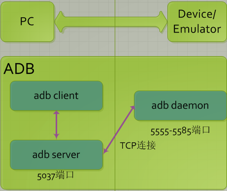

# adb,am,pm的常用命令


## adb常用命令与参数说明

### 简介

Android Debug Bridge，我们一般简称为adb，主要存放在sdk安装目录下的platform-tools文件夹中，它是一个非常强大的命令行工具，通过这个工具你能够与你的android设备进行交互。同时这是一个包含了以下三部分的cs模式的程序:



#### adb client

从图中，我们知道client是运行在PC端的，每当我们发起一个adb命令的时候，就会开启一个client程序。当然，当我们开启DDMS或者ADT的时候，也会自动创建client。

当我们开启一个client的时候，它首先会去检测后台是否已经有一个server程序在运行着，否则会开启一个adb-server进程。

所有的client都是通过5037端口与adb-server进行通信的。

#### adb daemon(adbd)

从图中，我们知道daemon是作为一个后台进程运行在模拟器/真实Android设备中的。

daemon使用端口的范围是5554-5585，每个模拟器/设备连接到PC端时，总会开启这么一个后台进程，并且为其分配了两个连续的端口，比如：

Emulator 1, console: 5554

Emulator 1, adb: 5555

也正因为每个设备都分一组两个端口，也已adb连接手机的最大数量为16。

说回端口的作用，在这两个端口中，其中偶数端口是用于server 与设备进行交互的，可以让server直接从设备中读取数据，而奇数端口是用来与设备的adbd进行连接通信的。

#### adb server

从图中，我们同样可以知道，server也是作为一个后台的程序运行在PC端的，他负责管理client进程以及adb daemon之间的通信。

当一个server开启的时候，他会自动绑定并且监听5037端口，接收client通过该端口发送过来的命令。同时server还会对5555-5585间的奇数端口进行扫描，进行对已连接设备的定位。

```shell
adb [-d|-e|-s <serialNumber>] <command>
```

> adb是必须的，接下来方括号[]里面的内容不是必须的，最后才是我们需要执行的命令操作，例如 adb -s emulator-5554 install UCBrowser.apk (这是安装UC浏览器的意思)
>
> 下面先介绍下，前面几个参数的含义吧：
>
> 　　-d: 让唯一连接到该PC端的真实安卓设备执行命令，如果发现USB中连接有多部设备，将会报错
>
> 　　-e: 让唯一连接到该PC端的模拟器执行命令，如果发现开启了多个模拟器，将会报错
>
> 　　-s：通过设备的序列号进行指定设备执行命令
>
> 如果设备只连接有一个设备或者一个模拟器的时候，可以不用声明这三个参数，adb默认会让这部唯一连接到的设备进行命令执行。

### 查看当前PC端连接有多少设备

```shell
adb devices
```

> 执行该命令，可能返回的状态有三种：
>
> I. device 设备已经成功连接到了adb-server
>
> II. offline 设备并没有连接到adb或者没有响应
>
> III. no device 并没有设备/模拟器连接

### 查看adb版本

```shell
adb version
```

### 给设备进行软件的安装

```shell
adb -s <serialNumber> install <path-to-apk>
```

除了上面这种方法，我们还有另外一个命令：

```shell
adb -s <serialNumber> shell pm install [options] <PATH>
```

其中[options]中最常用的选项是-r，代表着本次安装是重新安装，会保留用户数据.

### 卸载设备中已经安装的软件

```shell
adb -s <serialNumber> uninstall <pkg_name>
```

 除了上面这种方法，我们还有另外一个命令：

```shell
adb -s <serialNumber> uninstall [options] <PACKAGE>
```

这里的options是-k，加上该参数表明卸载软件后依旧保留用户数据.

### 查看某个apk文件的package name

```shell
#在电脑上查看,必须使用aapt工具
aapt dump badging <file.apk>
#必须有root权限,/data/data目录下有所有app的package name,以时间倒序排列就能获得最新安装app的package name
ls -lt /data/data
#打开app后在shell执行
dumpsys window windows | grep -i current
#会打印很多信息,需要筛选
logcat | grep -i ActivityManager
#如果有源码,可以看源码中的AndroidManifest.xml文件看package
```

### 查看app相关信息,包括action,codepath,version,权限等

```shell
adb shell dumpsys package <package_name>
```

### 查看app的内存占用

```shell
adb shell dumpsys memeinfo <package_name>
```

### 查看单个应用程序的最大内存限制

```shell
adb shell getprop | grep heapgrowthlimit
```

### 将数据从设备复制到PC中

```shell
adb -s <serialNumber>pull <remote> <local>
#eg:
#adb -s 99eb07a9 pull /sdcard/stericson-ls D://
```

### 将数据从PC端复制到设备中

```shell
adb -s <serialNumber>push <local> <remote>
#eg:
#adb -s 99eb07a9 push d://stericson-ls /sdcard/
```

### 等待设备连接成功

```shell
adb wait-for-device
```

该命令将会阻塞一直到默认连接的那部机器状态变为device，也就是连接成功。

### 将设备的某个端口重定向到另一个端口

```shell
adb forward tcp:1314 tcp :8888
```

执行该命令后所有发往宿主机1314端口的消息，数据都会转发到Android设备的8888端口上，因此可以通过远程的方式控制Android设备。

### adb远程连接Android设备

```shell
adb connect ip
```

### 发送文本,keyevent,点击,滑动

```shell
adb shell input ...
#usage:	input ...
#		input text <string>
#		input keyevent <key code number or name> 具体键值自行搜索
#		input tap <x> <y> 
#		input swipe <x1> <y1> <x2> <y2>
```

### adb-server 的开启与关闭

```shell
adb kill-server
adb start-server
```

有时候我们开启server会失败，这是因为我们装了的手机助手，豌豆荚或者其他软件自带有自己的adb，导致端口冲突开启失败。主要关掉那些软件并且杀掉那些软件自带的adb进程重来即可。

### 在设备上以root权限重启adb daemon

```shell
adb root
```

### 将system分区以可读可写重新挂载

```shell
adb remount
```

### 重启设备,可选参数进入bootloader(刷机模式)或recovery(恢复模式)或fastboot

```shell
adb reboot [bootloader|recovery|fastboot]
```

### 手机执行Shell命令

众所周知，Android的内核本身就是Linux，所以Android本身也支持Linux命令，但是因为是手机系统，所以进行了一定的删减，部分命令不支持，而不支持的部分，我们可以通过安装busybox这个软件进行填补。

```shell
adb shell <command>
```

或者直接进入Android的shell

```shell
adb shell
```

### 截图

```shell
adb shell screencap -p /sdcard/screen.png
```

截图,保存在/sdcard/screen.png

### 屏幕录像

例如，屏幕开始录像并且储存到/sdcard中，同时名字为demo.mp4

```shell
adb shell screenrecord /sdcard/demo.mp4
```

命令执行后会一直录制180s，按下ctrl+c可以提前结束录制

参数 –time-limit N，限制视频录制时间为N秒

对于高分辨率的手机，录制的视频很大，我们分享又不需要这么大的,我们可以设置录制的视频分辨率,使用参数--size 848*480

默认比特率是4M/s，为了分享方便，我们可以调低比特率为2M,使用参数--bit-rate 2000000

### 列出设备上的输入法

```shell
adb shell ime list -s 
#例子结果为
#com.google.android.inputmethod.pinyin/.PinyinIME
#com.baidu.input_mi/.ImeService
```

### 选择输入法

```shell
adb shell ime set com.baidu.input_mi/.ImeService
```

### 关闭设备请求,开启设备

```shell
adb shell stop
adb shell start
```

### 设备关机及重启

```shell
adb reboot
adb shutdown
```

### 查看Android设备的参数信息

```shell
adb shell getprop
#结果以key : value键值对的形式显示，如要获取某个键的值：
adb shell getprop ro.build.version.sdk
#获取设备的sdk版本
```

### 查看设备型号信息

```shell
adb shell cat /system/build.prop
```

ro.product.model就是设备型号,ro.product.brand就是设备生产商

或者

```shell
adb shell getprop | grep product
```

### 查看设备分辨率

```shell
adb shell wm size
```

### 查看手机sdk版本

```shell
adb shell getprop | grep version
```

实际上查看/system/build.prop文件也能看到

### 获取设备的序列号

```shell
adb get-serialno
```

### 获取设备的连接状态

```shell
adb -s <serialNumber> get-state
```

### 查看设备log

```shell
adb logcat
#-s 过滤指定参数log
#-d	打印完所有日志后返回,而不会一直等待
#-c	清空log并退出
#-v	格式化输出Log，其中format有如下可选值：
#	time	打印时间
#	brief	显示优先级/标记和原始进程的PID (默认格式)
#	process	仅显示进程PID
#	tag		仅显示优先级/标记
#	thread	仅显示进程：线程和优先级/标记
#	raw		显示原始的日志信息，没有其他的元数据字段
#	time	显示日期，调用时间，优先级/标记，PID
#	long	显示所有的元数据字段并且用空行分隔消息内容
```

### 在log中打印自己设定的信息

```shell
adb shell log -p d -t lzhlog "lizhihenglog"
#-p	优先级
#-t	标签,后面加上消息,这里是"lizhihenglog"
```


## Activity Manager 常用命令与参数说明

可以使用am命令去模拟各种系统的行为，例如去启动一个activity，强制停止进程，发送广播等

首先理解一下这几个概念的意思

* 活动(Activity) - 用于表现功能
* 服务(Service) - 相当于后台运行的 Activity
* 广播(Broadcast) - 用于发送广播
* 广播接收器(BroadcastReceiver) - 用于接收广播
* Intent - 用于连接以上各个组件，并在其间传递消息

```shell
adb shell am start 包名/.类名
#或者
adb shell am start 包名/类的全名
#-a		传入动作
#-n		传入组件（package）
#-t		传入类型
#-d		传入数据
```

 一般情况下，我们最常用它来进行app的开启，并且传递一定的参数过去,比如：

```shell
adb shell am start -a android.intent.action.VIEW -n cn.uc.test/.MainActivity -d http://www.baidu.com
```

### 拨打电话

```shell
adb shell am start -a android.intent.action.CALL -d tel:10086
```

### 打开网站

```shell
adb shell am start -a android.intent.action.VIEW -d  http://gityuan.com
```

### 启动Activity

```shell
#启动包名为com.yuanhh.app，主Activity为.MainActivity，且extra数据以”website”为key, “yuanh.com”为value。通过java代码要完成该功能虽然不复杂，但至少需要一个android环境，而通过adb的方式，只需要在adb窗口，输入如下命令便可完成:
am start -n com.yuanhh.app/.MainActivity -es website gityuan.com
```

### 杀死进程

```shell
adb shell am force-stop com.android.fmradio
```


详情的可以参考：<http://developer.android.com/tools/help/adb.html#IntentSpec>

在这里就不做太过详细和重复的说明了


## Package Manager 常用命令与参数说明

### 使一个apk处于禁用状态，相当于卸载了

```shell
disable <PACKAGE_OR_COMPONENT>
#其中 PACKAGE_OR_COMPONENT的格式是 package/class， 如 com.UCMobile/.main.UCMobile
#eg:
#adb shell su disable com.UCMobile/.main.UCMobile
```

同时我们在手机上发现，UC浏览器的图标不见了

### 查看一个apk所在的路径

```shell
pm path <Package>
#eg:
#adb shell pm path com.UCMobile
```

### 查看手机中装的所有的包

```shell
pm list packages
#-s	列出系统应用
#-3	列出第三方应用
#-f	列出应用包名及对应的apk名及存放位置
#-i	列出应用包名及其安装来源
#参数组合使用，例如，查找三方应用中知乎的包名，apk存放位置，安装来源：
#adb shell pm list package -f -3 -i zhihu
```

### 列出对应包名的.apk位置

```shell
pm path com.tencent.mobileqq
#和pm list package -f部分功能相同
```

### 列出指定应用的转储信息

```shell
adb shell pm dump com.tencent.mobileqq
```

### 安装和卸载apk

```shell
pm install apkname
pm uninstall apkname
#apk必须在安卓设备里
```

### 设置,获取应用安装位置

```shell
pm set-install-location
pm get-install-location
#获取得到的值分别为:
#[0 / auto]：默认为自动
#[1 / internal]：默认为安装在手机内部
#[2 / external]：默认安装在外部存储
```

再次不做过多的说明

### 清除apk的数据和缓存

```shell
adb shell pm clear <PACKAGE>
```

具体更多的详情，可以参考：http://developer.android.com/tools/help/adb.html#IntentSpec


## 参考资料

[[Android学习第一天-adb常用命令](https://www.cnblogs.com/xiaoxuetu/p/3411214.html)]

[安卓测试常用的 ADB 命令大全，非常全！！！！！](https://blog.csdn.net/MzTestor/article/details/79310900)

[adb之am、pm命令](https://blog.csdn.net/picasso_l/article/details/78683405)

